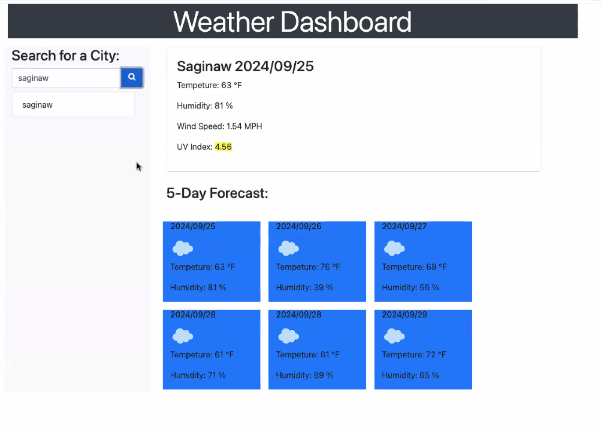

# weather-api

  ## Description
  Allows users to view a 5 day weather forecast for a given city.
  ## Features
  
  ## Installation
  clone the project.run with live server
  ## How to Use This Application:
  Utilize the search box to input a city of choice.  Forecast will display on the page.  Local storage will allow cities to persist on the page. 
  ## Contributors
  Matt W. 

 ## Screenshot

